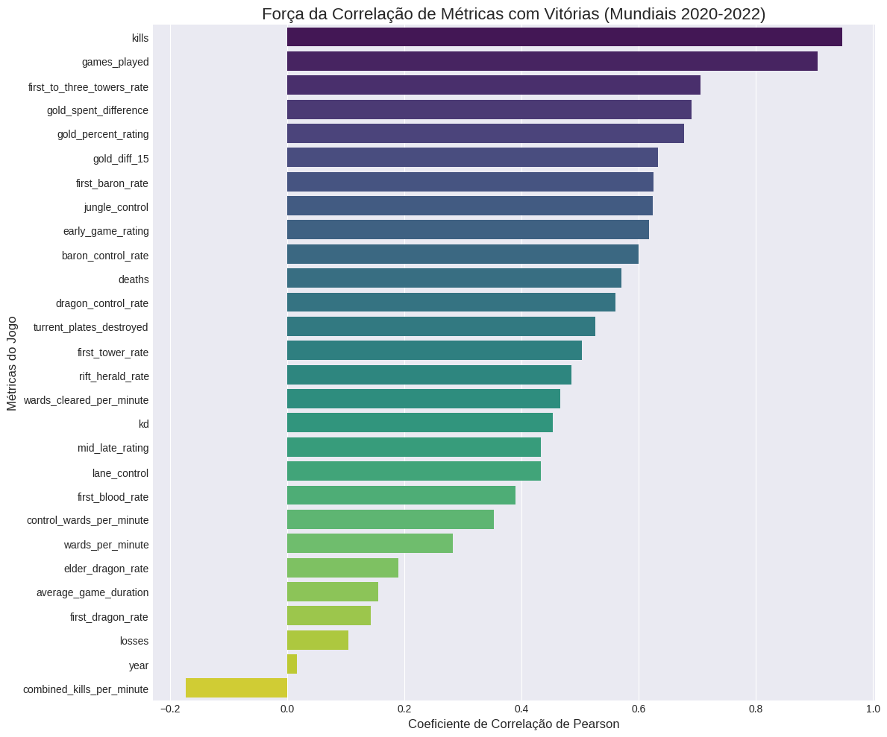
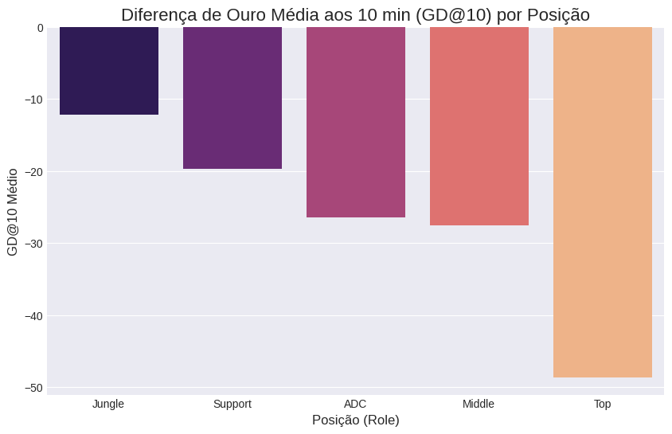
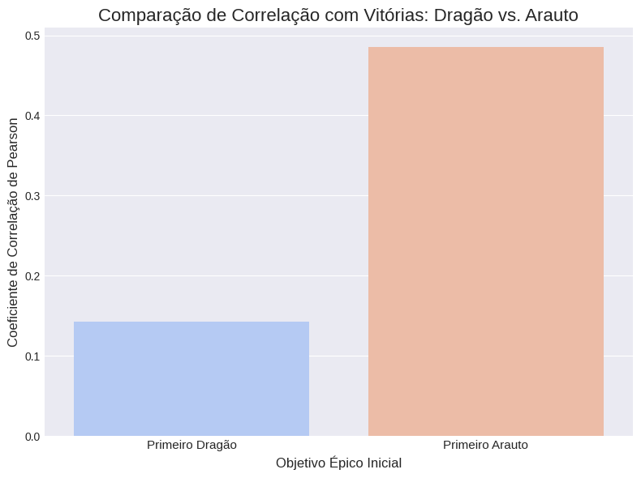
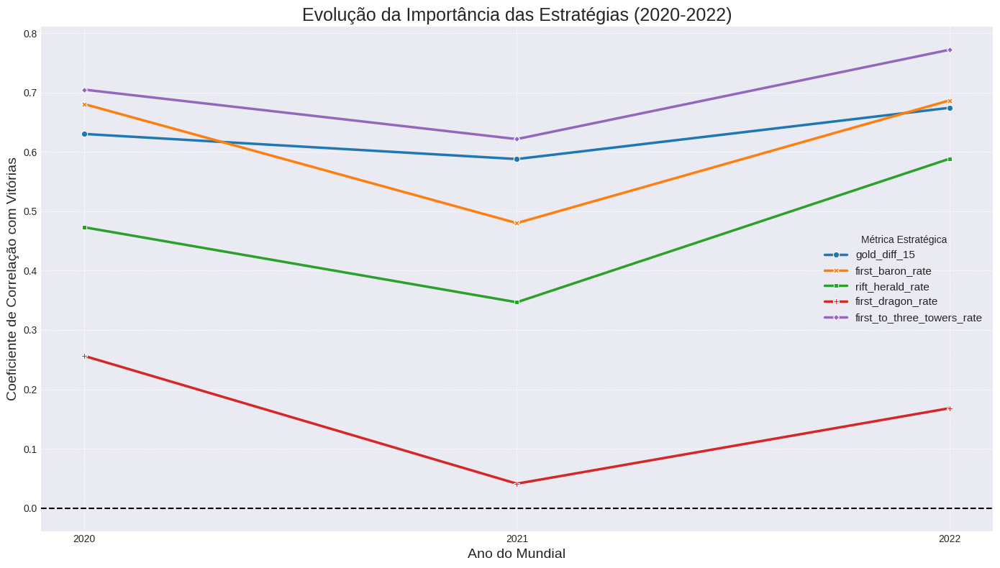

# Análise de Fatores de Vitória nos Mundiais de League of Legends (2020-2022)

## 📝 Resumo do Projeto

Este projeto realiza uma Análise Exploratória de Dados (EDA) focada nos Campeonatos Mundiais de League of Legends de 2020, 2021 e 2022. O objetivo principal é dissecar as estatísticas de times e jogadores para identificar os fatores que mais se correlacionam com a vitória no cenário profissional de elite e observar a evolução do "metagame" ao longo desses anos.

Este projeto demonstra habilidades em aquisição de dados, limpeza, análise exploratória e visualização de dados usando Python.

## 🎯 Principais Perguntas Respondidas

1.  Quais estatísticas de jogo (ouro, objetivos, abates) têm maior impacto no número de vitórias de um time?
2.  Existem "mitos" ou crenças populares sobre o jogo que não se sustentam nos dados profissionais?
3.  Como as estratégias vencedoras evoluíram de 2020 a 2022?

## 💡 Principais Descobertas (Key Insights)

### 🐉 O Mito do Primeiro Dragão
A análise revelou que a conquista do **Primeiro Dragão** tem uma correlação muito baixa com a vitória. Em contraste, o **Primeiro Arauto do Vale** é significativamente mais impactante. Os dados mostram uma correlação negativa entre os dois, sugerindo que as equipes realizam uma **troca estratégica**, priorizando o Arauto para obter vantagens imediatas de ouro e pressão de mapa.

### 👑 Vantagem Econômica e Pressão de Mapa
Os fatores com maior correlação positiva com as vitórias são:
* `first_to_three_towers_rate` (Taxa de destruição das 3 primeiras torres)
* `gold_diff_15` (Diferença de ouro aos 15 minutos)
* `first_baron_rate` (Taxa de conquista do primeiro Barão)

### 📊 Evolução do Metagame
* A importância do **Arauto do Vale aumentou** consistentemente de 2020 a 2022.
* A importância do **Primeiro Barão** teve uma queda notável em 2021, mas voltou a ser crucial em 2022 (padrão em "V").
* A **pressão de mapa** (destruição de torres) se manteve como o fator mais importante em todos os anos.

### 🎮 Impacto dos Jogadores (GD@10)
* A rota da **Selva (Jungle)** é a que, em média, consegue manter a melhor estabilidade de ouro no início do jogo.
* A rota do **Topo (Top)** é a mais volátil e punitiva em termos de desvantagem de ouro.
* Apesar das médias, jogadores excepcionais em qualquer rota podem criar vantagens massivas individualmente.

## 📁 Fonte dos Dados

Os dados foram obtidos de datasets públicos no Kaggle, cobrindo as fases "Play-In" e "Main Stage" dos mundiais:
* [Worlds 2020](https://www.kaggle.com/datasets/ilyadziamidovich/league-of-legends-world-championship-2020)
* [Worlds 2021](https://www.kaggle.com/datasets/ilyadziamidovich/league-of-legends-world-championship-2021)
* [Worlds 2022](https://www.kaggle.com/datasets/ilyadziamidovich/league-of-legends-world-championship-2022)

## 🛠️ Tecnologias Utilizadas

* **Linguagem:** Python
* **Ambiente:** Google Colab / Jupyter Notebook
* **Bibliotecas:**
    * `Pandas`: Manipulação e limpeza de dados.
    * `NumPy`: Operações numéricas.
    * `Matplotlib` & `Seaborn`: Visualização de dados.
    * `KaggleHub`: Aquisição e download de datasets.

## 📊 Destaques da Análise (Visualizações)

1.  **Gráfico de Correlação Geral:**

  
2.  **GD@10 por Posição:**

  
3.  **Dragão vs. Arauto (Comparação):**

4.  **Evolução do Metagame:** *(Inserir imagem do gráfico de linhas 2020-2022)*

## 🚀 Como Executar Este Projeto

1.  Clone este repositório.
2.  Certifique-se de ter Python instalado e as bibliotecas listadas acima (`pip install pandas numpy matplotlib seaborn kagglehub`).
3.  Abra o notebook `Analise_Mundiais_LoL_2020_2022.ipynb`.
4.  Execute as células sequencialmente. O `kagglehub` cuidará do download dos dados (pode requerer autenticação do Kaggle).
